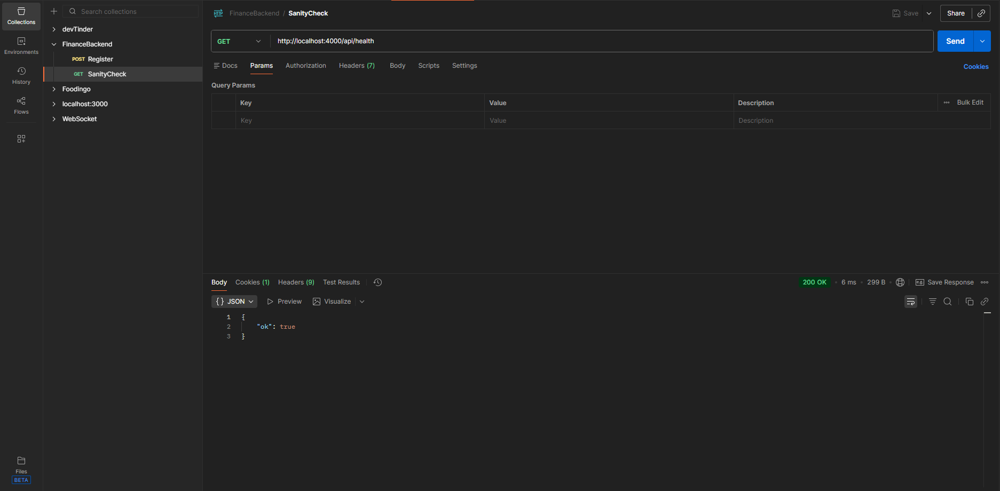
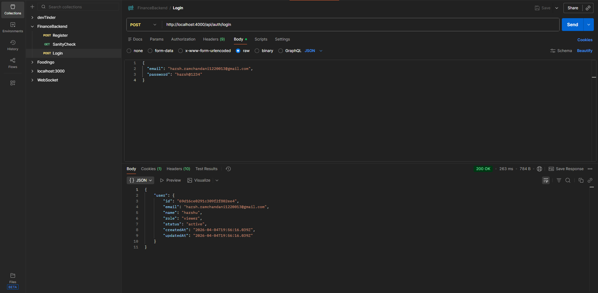
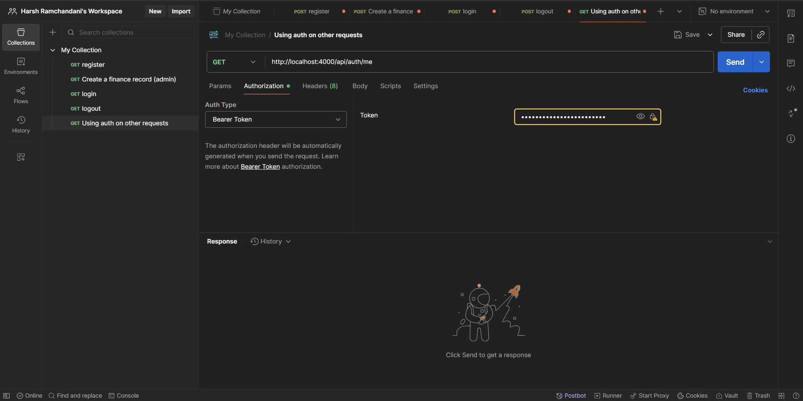
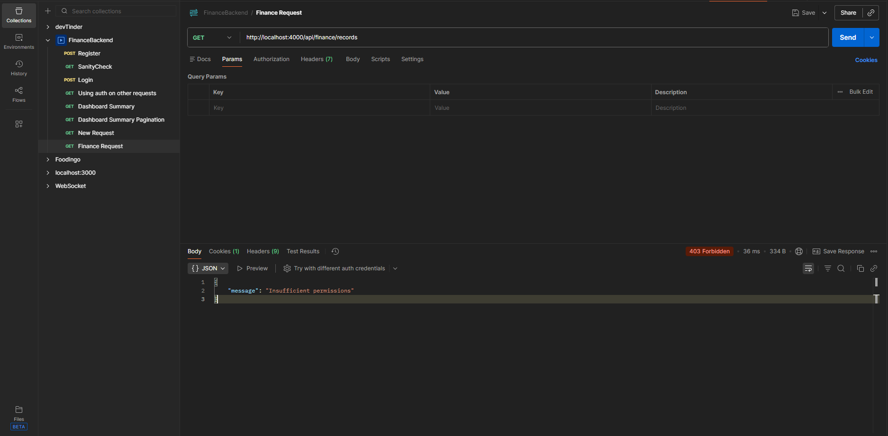
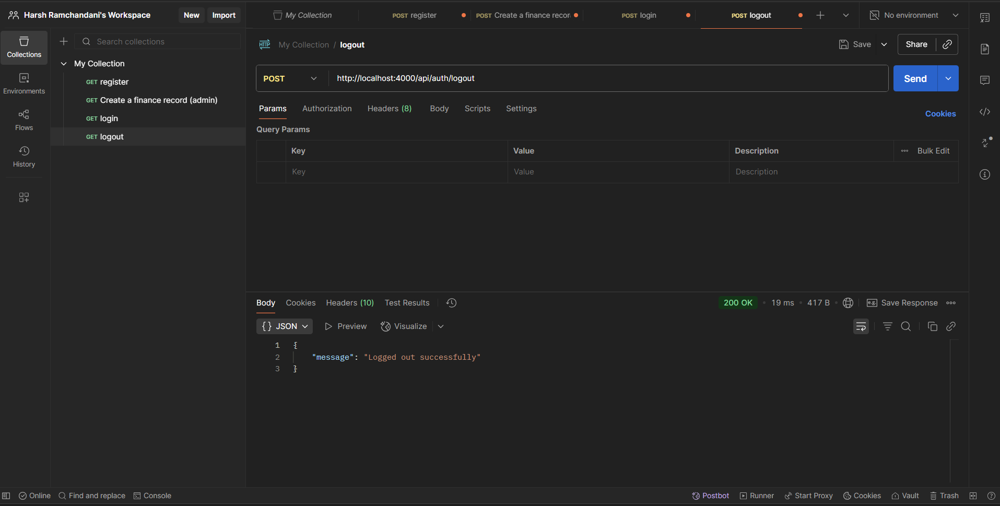

# API Testing
## 1. Sanity check
- Method: GET
- URL: `http://localhost:4000/api/health`
- Send → expect 200 and body 
```json
{ 
  "ok": true 
}
```



## 2. Register (creates first user as admin on a fresh DB)
- Method: POST
- URL: `http://localhost:4000/api/auth/register`
- Headers: Content-Type = application/json
- Body → raw → JSON, e.g.:
```json
{
  "email": "you@example.com",
  "password": "yourpassword",
  "name": "You"
}
```

- Input
```json
{
  "email": "harsh.ramchandani1220013@gmail.com",
  "password": "harsh@1234",
  "name": "harshu"
}
```

- Output 
```json
{
    "user": {
        "id": "69d16ce0291c309f2f802ee4",
        "email": "harsh.ramchandani1220013@gmail.com",
        "name": "harshu",
        "role": "viewer",
        "status": "active",
        "createdAt": "2026-04-04T19:56:16.039Z",
        "updatedAt": "2026-04-04T19:56:16.039Z"
    }
}
```

- Send → 201. Postman can sto`re the cookie automatically for this domain.


## 3. Login (if you already have a user)
- POST `http://localhost:4000/api/auth/login`
- Same JSON shape (email, password).
- Response 200 with user; cookie token should be set if you use the Postman cookie jar (see below).

- Input
```json
{
  "email": "harsh.ramchandani1220013@gmail.com",
  "password": "harsh@1234",
}
```

- Output 
```json
{
    "user": {
        "id": "69d16ce0291c309f2f802ee4",
        "email": "harsh.ramchandani1220013@gmail.com",
        "name": "harshu",
        "role": "viewer",
        "status": "active",
        "createdAt": "2026-04-04T19:56:16.039Z",
        "updatedAt": "2026-04-04T19:56:16.039Z"
    }
}
```


## 4. Using auth on other requests
- Option A – Cookie (easiest in Postman)
Postman Settings → enable “Send cookies with requests” (and use the same host localhost:4000).
After register/login, call e.g. GET `http://localhost:4000/api/auth/me` — no extra headers if the cookie is sent.


- Option B – Bearer token
Copy the JWT from the Set-Cookie header value for token=..., or sign in and read the cookie in Postman’s Cookies link under the URL bar.
Or use Authorization → type Bearer Token → paste the token value.
GET `http://localhost:4000/api/auth/me`




## 5. Try a protected route
- Examples (with cookie or Bearer):
  - GET `http://localhost:4000/api/dashboard/summary`


```json
{
    "summary": {
        "totalIncome": 42.5,
        "totalExpense": 0,
        "netBalance": 42.5
    },
    "categoryTotals": [
        {
            "category": "verification",
            "income": 42.5,
            "expense": 0,
            "net": 42.5
        }
    ],
    "recentActivity": [
        {
            "id": "69d0f45aeb88ff548e3e66a6",
            "amount": 42.5,
            "type": "income",
            "category": "verification",
            "date": "2026-04-04T00:00:00.000Z",
            "notes": "verify-db-insert script",
            "createdAt": "2026-04-04T11:22:02.167Z"
        }
    ],
    "trends": {
        "granularity": "month",
        "buckets": [
            {
                "period": "month",
                "year": 2026,
                "month": 4,
                "label": "2026-04",
                "income": 42.5,
                "expense": 0,
                "net": 42.5
            }
        ]
    },
    "filters": {
        "dateFrom": null,
        "dateTo": null
    }
}
```

  - GET `http://localhost:4000/api/finance/records?page=1&limit=20` (needs analyst or admin)
```json

```


- If your test user is only viewer, finance list will return 403; register first user is admin, or create an analyst/admin via POST /api/users as admin.


## 6. Create a finance record (admin)
POST `http://localhost:4000/api/finance/records`
Body JSON:
```json
{
  "amount": 120.5,
  "type": "income",
  "category": "salary",
  "date": "2026-04-01",
  "notes": "Test"
}
```

- Output (without admin rights)


```json
{
    "message": "Insufficient permissions"
}
```

- Output (with admin rights)


```json
{
    "record": {
        "id": "69d17ff85990cbc8fb05746c",
        "amount": 120.5,
        "type": "income",
        "category": "salary",
        "date": "2026-04-01T00:00:00.000Z",
        "notes": "Test",
        "createdBy": "69d1792580b81667816ed65a",
        "createdAt": "2026-04-04T21:17:44.200Z",
        "updatedAt": "2026-04-04T21:17:44.200Z"
    }
}
```

## 7. Logout
POST `http://localhost:4000/api/auth/logout` → 204; cookie cleared.

- Output


```json
{
    "message": "Logged out successfully"
}
```

- Flow diagrams:

