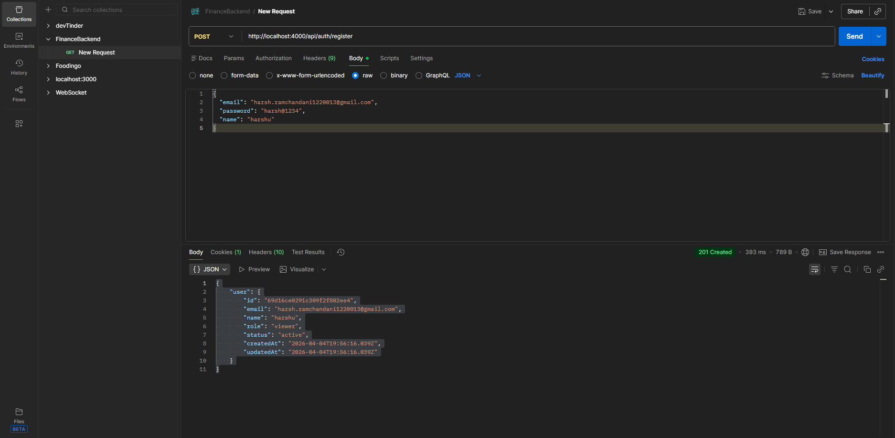
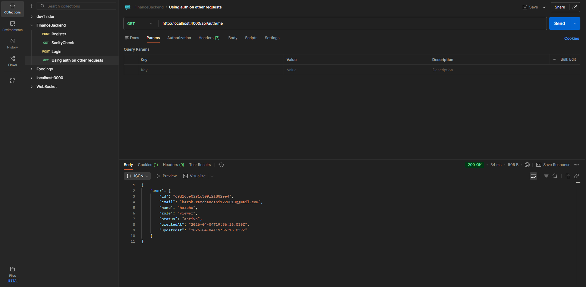
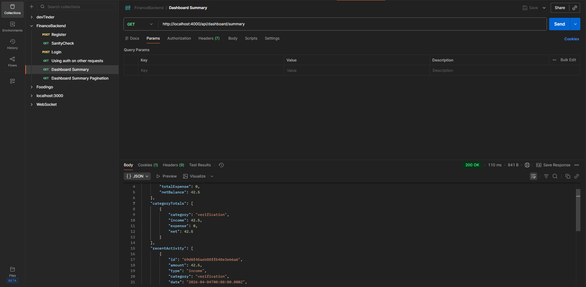
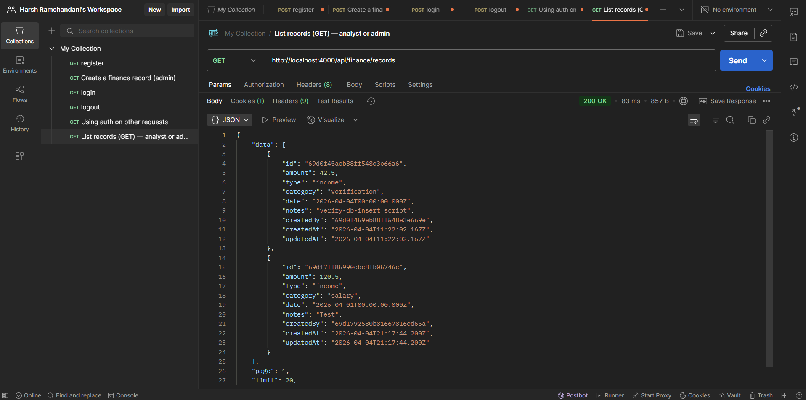
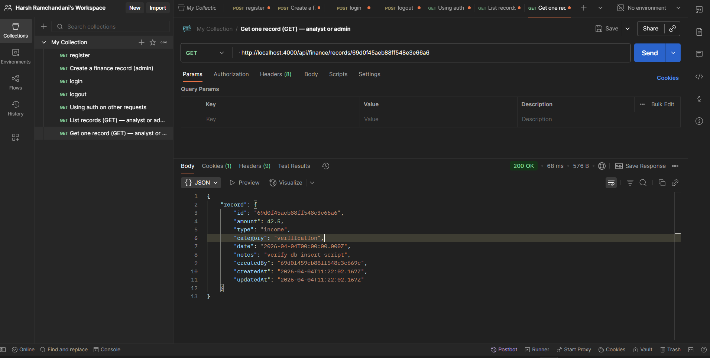
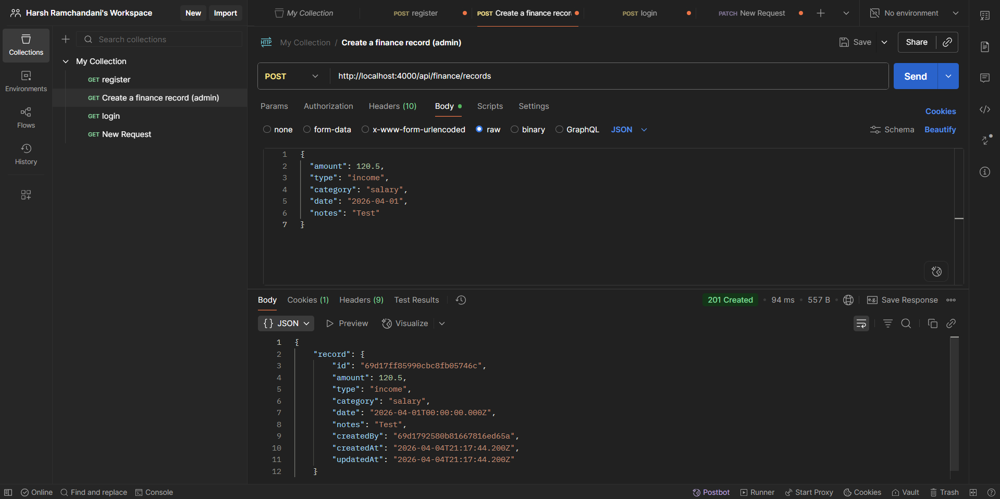
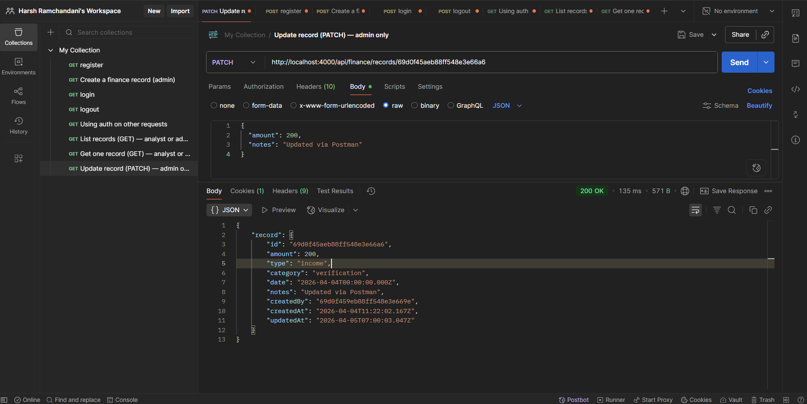
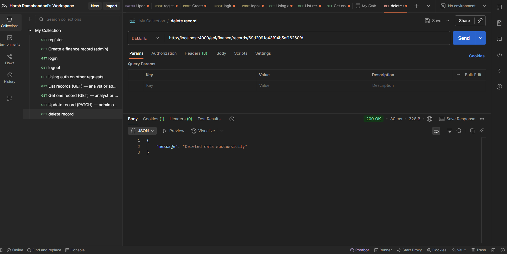

# API Testing
---

## 1. Sanity check

- Method: GET
- URL: `http://localhost:4000/api/health`
- Send → expect 200 and body 
```json
{
  "ok": true
}
```


---

## 2. Register (creates first user as admin on a fresh DB)

- Method: POST
- URL: `http://localhost:4000/api/auth/register`
- Headers: Content-Type = application/json
- Body → raw → JSON, e.g.:

```json
{
  "email": "you@example.com",
  "password": "yourpassword",
  "name": "You"
}
```

- Input

```json
{
  "email": "harsh.ramchandani1220013@gmail.com",
  "password": "harsh@1234",
  "name": "harshu"
}
```

- Output

```json
{
    "user": {
        "id": "69d16ce0291c309f2f802ee4",
        "email": "harsh.ramchandani1220013@gmail.com",
        "name": "harshu",
        "role": "viewer",
        "status": "active",
        "createdAt": "2026-04-04T19:56:16.039Z",
        "updatedAt": "2026-04-04T19:56:16.039Z"
    }
}
```

- Send → 201. Postman can store the cookie automatically for this domain.



---

## 3. Login (if you already have a user)

- POST `http://localhost:4000/api/auth/login`
- Same JSON shape (email, password).
- Response 200 with user; cookie token should be set if you use the Postman cookie jar (see below).

- Input

```json
{
  "email": "harsh.ramchandani1220013@gmail.com",
  "password": "harsh@1234"
}
```

- Output

```json
{
    "user": {
        "id": "69d16ce0291c309f2f802ee4",
        "email": "harsh.ramchandani1220013@gmail.com",
        "name": "harshu",
        "role": "viewer",
        "status": "active",
        "createdAt": "2026-04-04T19:56:16.039Z",
        "updatedAt": "2026-04-04T19:56:16.039Z"
    }
}
```


---

## 4. Using auth on other requests

- **Option A – Cookie (easiest in Postman)**  
  Postman Settings → enable “Send cookies with requests” (and use the same host localhost:4000).  
  After register/login, call e.g. GET `http://localhost:4000/api/auth/me` — no extra headers if the cookie is sent.



- **Option B – Bearer token**  
  Copy the JWT from the Set-Cookie header value for `token=...`, or open **Cookies** under the URL bar.  
  Or use **Authorization → Type: Bearer Token** → paste the token value only (not the `token=` prefix).  
  GET `http://localhost:4000/api/auth/me`


---

## 5. Dashboard (protected route example)

With cookie or Bearer set, call:

- GET `http://localhost:4000/api/dashboard/summary`

Optional query: `dateFrom`, `dateTo`, `trend` (`month` or `week`).



Example response shape:

```json
{
    "summary": {
        "totalIncome": 42.5,
        "totalExpense": 0,
        "netBalance": 42.5
    },
    "categoryTotals": [
        {
            "category": "verification",
            "income": 42.5,
            "expense": 0,
            "net": 42.5
        }
    ],
    "recentActivity": [
        {
            "id": "69d0f45aeb88ff548e3e66a6",
            "amount": 42.5,
            "type": "income",
            "category": "verification",
            "date": "2026-04-04T00:00:00.000Z",
            "notes": "verify-db-insert script",
            "createdAt": "2026-04-04T11:22:02.167Z"
        }
    ],
    "trends": {
        "granularity": "month",
        "buckets": [
            {
                "period": "month",
                "year": 2026,
                "month": 4,
                "label": "2026-04",
                "income": 42.5,
                "expense": 0,
                "net": 42.5
            }
        ]
    },
    "filters": {
        "dateFrom": null,
        "dateTo": null
    }
}
```

---

## 6. Finance records — CRUD in Postman

All routes are under **`/api/finance/records`**. Use the same auth as in §4 (cookie jar or Bearer).

**Screenshots:** Save files under `api-testing-images/` and point the `` paths below at your filenames (or replace the placeholder `src` with your image paths).

### 6.1 Roles (what you will see in Postman)

| Action | Method & path | Allowed roles |
|--------|----------------|---------------|
| List + filter | GET `/api/finance/records` | **analyst**, **admin** |
| Get one | GET `/api/finance/records/:id` | **analyst**, **admin** |
| Create | POST `/api/finance/records` | **admin** only |
| Update | PATCH `/api/finance/records/:id` | **admin** only |
| Delete | DELETE `/api/finance/records/:id` | **admin** only |

- **Viewer** gets **403** on list/create (finance is not allowed for viewers).  

### 6.2 List records (GET) — analyst or admin

- **GET** `http://localhost:4000/api/finance/records`
- Optional query parameters:
  - `page` (default 1), `limit` (default 20, max 100)
  - `type`: `income` or `expense`
  - `category`: exact match, case-insensitive
  - `dateFrom`, `dateTo`: filter by record `date` (inclusive range)

Example:

`http://localhost:4000/api/finance/records?page=1&limit=20&type=income&dateFrom=2026-01-01&dateTo=2026-12-31`

Expect **200** with `data`, `page`, `limit`, `total`.

<!-- Screenshot: Postman GET list with Params tab / response -->



### 6.3 Get one record (GET) — analyst or admin

- **GET** `http://localhost:4000/api/finance/records/<RECORD_ID>`

Replace `<RECORD_ID>` with an `id` from the list response.

Expect **200** with `{ "record": { ... } }`. Invalid id → **400**; missing record → **404**.

<!-- Screenshot: Postman GET by id -->



### 6.4 Create record (POST) — admin only

- **POST** `http://localhost:4000/api/finance/records`
- Body (raw JSON):

```json
{
  "amount": 120.5,
  "type": "income",
  "category": "salary",
  "date": "2026-04-01",
  "notes": "Test"
}
```

Expect **201** and a `record` object with `id`, `createdBy`, timestamps.

**Without admin** (e.g. analyst or viewer) → **403**:

```json
{
    "message": "Insufficient permissions"
}
```


```json
{
    "message": "Insufficient permissions"
}
```

**With admin:**



```json
{
    "record": {
        "id": "69d17ff85990cbc8fb05746c",
        "amount": 120.5,
        "type": "income",
        "category": "salary",
        "date": "2026-04-01T00:00:00.000Z",
        "notes": "Test",
        "createdBy": "69d1792580b81667816ed65a",
        "createdAt": "2026-04-04T21:17:44.200Z",
        "updatedAt": "2026-04-04T21:17:44.200Z"
    }
}
```

### 6.5 Update record (PATCH) — admin only

- **PATCH** `http://localhost:4000/api/finance/records/<RECORD_ID>`
- Send only fields to change, e.g.:

```json
{
  "amount": 200,
  "notes": "Updated via Postman"
}
```

Expect **200** with updated `record`. No valid fields → **400**. Wrong role → **403**.

<!-- Screenshot: Postman PATCH update -->



### 6.6 Delete record (DELETE) — admin only

- **DELETE** `http://localhost:4000/api/finance/records/<RECORD_ID>`

Expect **200** on success with a JSON body, for example:

```json
{
  "message": "Deleted data successfully"
}
```

This is a **soft delete**: the row stays in MongoDB with `deletedAt` set; it no longer appears in list, get-by-id, or dashboard totals (see **§7.3**).

Missing id / bad id → **400** or **404**.



### 6.7 Common status codes (quick reference)

| Code | Typical cause |
|------|----------------|
| **401** | Missing or invalid JWT; log in again or fix Bearer token |
| **403** | Wrong role (e.g. viewer on finance, or non-admin on POST/PATCH/DELETE) or inactive user |
| **404** | Record id not found (GET/PATCH/DELETE) |
| **400** | Validation errors (body or query); response may include `details` |

---

## 7. Optional enhancements — how to test in Postman

These map to **[requirements coverage](../docs/requirements-coverage.md)**. Below is what you can prove **from Postman** (plus one terminal section for automated tests).

### 7.1 Pagination

**Finance list**

1. Log in as **analyst** or **admin** (§3–4).
2. **GET** `http://localhost:4000/api/finance/records?page=1&limit=2`  
   - Check the JSON: `page`, `limit`, `total`, and `data` length ≤ `limit`.
3. If `total` > 2, **GET** the same URL with `page=2` — you should see the next slice of records (or an empty `data` if there are no more).

Same Postman layout as **§6.2** (list + Params). Screenshot reuses **`read.png`**:


**Users list (admin)**

1. Log in as **admin**.
2. **GET** `http://localhost:4000/api/users?page=1&limit=5`  
   - Expect **200** with JSON fields `page`, `limit`, `total`, and `data` (array of users).

Same pagination fields as finance; there is no separate figure earlier — use the **same Params / Body panel style** as **`read.png`**, with the URL set to `/api/users`.

### 7.2 Filtering (type, category, date range)

This is **structured filtering**, not full-text search across notes.

1. Create a few records with different **type**, **category**, and **dates** (§6.4) or use existing data.
2. **GET** examples (adjust host and query values):

`http://localhost:4000/api/finance/records?type=income`

`http://localhost:4000/api/finance/records?category=salary`

`http://localhost:4000/api/finance/records?dateFrom=2026-01-01&dateTo=2026-12-31`

3. Confirm `data` only includes rows that match; `total` reflects the filter.

Still the **same** `GET /api/finance/records` screen as **§6.2** — only the query string changes. Screenshot reuses **`read.png`**:


### 7.3 Soft delete (verify behaviour)

1. **POST** a record as **admin** (§6.4) — screenshot **`image-1.png`** (successful create).
2. **DELETE** `http://localhost:4000/api/finance/records/<RECORD_ID>` — expect **200** and `"Deleted data successfully"` — same as **§6.6**, **`dr.png`**.
3. **GET** `http://localhost:4000/api/finance/records/<RECORD_ID>` — expect **404** — same Postman layout as **§6.3** — **ger.png**, with a **404** response body.
4. **GET** `http://localhost:4000/api/finance/records` — that id should **not** appear in `data` — **`read.png`** (list).
5. **GET** `http://localhost:4000/api/dashboard/summary` — totals / recent activity should **not** still count that row — same as **§5**, **`image-5.png`**.


### 7.4 Rate limiting

The API limits requests **per IP** (defaults: **60 / 15 min** on `/api/auth`, **300 / 15 min** on other protected `/api` routes). In **tests** (`NODE_ENV=test`) limits are **off** — use a normal dev server for this check.

**Easier local check (temporarily strict env)**

1. In `financedashboardbackend/.env` set e.g. `RATE_LIMIT_AUTH_MAX=3` (and restart `npm run dev -w financedashboardbackend`).
2. Send **POST** `/api/auth/login` **four times in a row** with valid JSON (same or different body). The request panel matches **§3** — **`imagel.png`**.
3. Expect the **fourth** response to be **429 Too Many Requests** with a JSON body like `{ "message": "Too many requests, please try again later." }` — same compact error JSON style as **§6.4** insufficient permissions — **`image-6.png`** (your **429** screenshot can replace or sit beside this pattern).
4. Remove or comment out the env var and restart so normal limits apply.

**Alternative:** use **Postman Collection Runner** to fire many **GET** `/api/dashboard/summary` requests with auth until you hit **429** — dashboard request matches **§5** — **image-5.png**; the **429** body matches the error style in **image-6.png**.


### 7.5 Automated integration tests (terminal, not Postman)

These are **not** exercised through Postman; they document that CI-style checks exist.

From the **repo root**:

```bash
npm test -w financedashboardbackend
```

Expect all tests to pass (in-memory MongoDB, no real DB required). There is no earlier screenshot for the terminal — add your own file under `api-testing-images/` if you want a figure here.

---

## 8. Logout

POST `http://localhost:4000/api/auth/logout` → **200**; cookie cleared; JSON body with message.

- Output


```json
{
    "message": "Logged out successfully"
}
```

