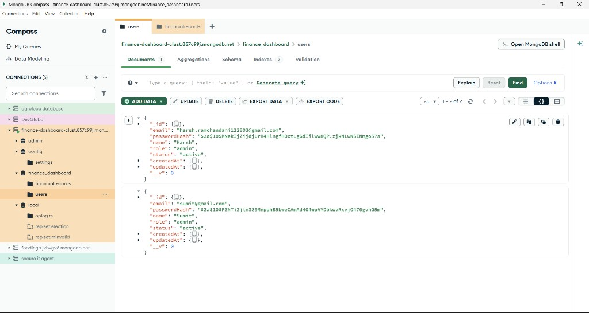
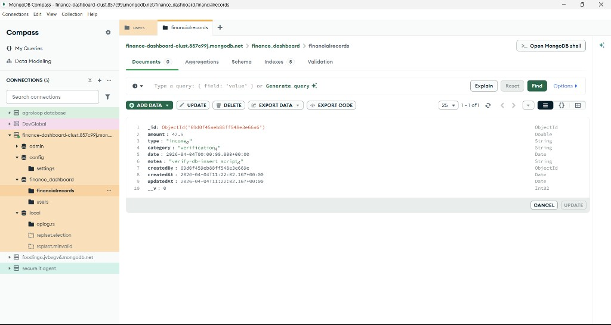

# Finance dashboard backend
- Backend API's for finance dashboard are build using ExpressJS and NodeJS over Mongo DB, the API's focus on JWT auth, role-based access, and aggregated summaries.
- The API's are written in the directory 'financedashboardbackend/`.
- The repo's packages are written in `package.json` so installs work locally and on Render.
- Serverless entry is `api/index.js` wrapping the same app with `serverless-http`.
- This project requires Node 18+, a MongoDB URI, and npm (root `package-lock.json`).

- Clone for Finance Data Processing and Access Control Backend.
```bash
git clone <repo-url>
cd <repo-directory>
```

## Quick start
- This project uses npm as a package manager. 
```bash
npm install
cp financedashboardbackend/.env.example financedashboardbackend/.env
```

## Project Setup
- Set **`MONGODB_URI`** and **`JWT_SECRET`** in `financedashboardbackend/.env` (use a long random secret in production).
```bash
npm test -w financedashboardbackend
npm run dev -w financedashboardbackend
```

`GET http://localhost:4000/api/health` → `{ "ok": true }`.

## Development (lint & format)
- From the repo root:
```bash
npm run lint
npm run format:check
npm run format
```

CI runs lint and format check before tests.

## Architecture (request flow)
```text
HTTP client
  → Express (financedashboardbackend/src/app.js)
  → X-Request-Id, cors, compression, json, cookie-parser
  → connectDb (MongoDB, pooled connection)
  → optional Redis if REDIS_URL (rate limits + dashboard cache)
  → /api → requireAuth / requireRoles
  → handler → services → Mongoose → JSON
```

## Layers
- Routes are written in a minimal way and they handle API requests.
- Services contain the main logic, including validation and database queries.
- Models define the data structure and indexes in `src/models/`.
- Architecture's detailed view is defined in : **[system design](docs/system-design.md)**
  - 4.1 HLD
  - 5.2 Sequence

## Documentation
- **[System design](docs/system-design.md)** — HLD/LLD, workflows, data model (Mermaid in §4.1, §5.2).  
- **[Feature checklist](docs/feature-checklist.md)** — Feature table.  
- **[openapi.yaml](docs/openapi.yaml)** — Route sketch + cross-cutting behaviour.  
- **[API Testing](API%20Testing.md)** — Postman-style steps; `api-testing-images/` has screenshots.  
- **`docs/images/`** — Compass PNGs above.

## Operations:
- The API is built with a few practical features to support reliability and performance:
- Stateless JWT is implemented for Secure Access.
- Optional MongoDB configurations can be done using the env vars.
- Gzip compression is implemented for smaller responses.
- `X-Request-Id` is implemented for request tracing.
- Health endpoints:
  - `/api/health` for basic health checks.
  - `/api/health/ready` for readiness checks.
- Graceful shutdown for clean server termination.
- Optional **`REDIS_URL`** shares rate-limit state and caches dashboard summaries (TTL; invalidated on finance writes).

Redis Support
- If REDIS_URL is provided, Redis is used to:
  - Share rate-limit state across instances.
  - Cache dashboard summaries with a TTL.
  - Clear cached summaries when finance data changes.

- Without Redis:
  - Rate limiting works in memory only.
  - Dashboard summaries are fetched from MongoDB on every request.

## RBAC matrix (simplified)
| Area | viewer | analyst | admin |
|------|:------:|:-------:|:-----:|
| `GET /api/dashboard/summary` | ✓ | ✓ | ✓ |
| `GET /api/finance/records`, `GET .../:id` | ✗ | ✓ | ✓ |
| `POST` / `PATCH` / `DELETE /api/finance/records` | ✗ | ✗ | ✓ |
| `/api/users/*` | ✗ | ✗ | ✓ |
| `POST /api/auth/register`, `POST /api/auth/login`, … | ✓ | ✓ | ✓ |

Inactive users get **403** on protected routes.

## Security notes
- Passwords are stored as bcrypt hashes and are never returned in API responses.
- Authentication uses JWTs signed with JWT_SECRET.
- Send the token with Authorization: Bearer <token> or use the httpOnly token cookie.
- Rate limiting is enabled for `/api/auth` and other `/api` routes. It is disabled when NODE_ENV=test.
- If REDIS_URL is set, rate limits are shared across multiple app instances using Redis.
- Do not commit `financedashboardbackend/.env`. Use .env.example instead.

| Issue | What we did |
|------|-------------|
| Short `JWT_SECRET` in production | Process exits on startup if `NODE_ENV=production` and secret shorter than 32 chars (`JWT_SECRET_MIN_LENGTH` overrides). See `src/config/envValidate.js`. |
| JWT algorithm tricks | Sign + verify with **HS256** only (`token.js`, `auth.js`). |
| NoSQL injection via `$` in input | **`express-mongo-sanitize`** on body/query/params after JSON parsing. |
| Bare minimum HTTP headers | **`helmet`** adds common security headers.CSP is turned off because this project is a JSON API and does not serve web pages.CORP is turned off so cross-origin requests and cookies can still work correctly. |
| Cookie scope | `httpOnly`, `secure` in prod, `SameSite` strict/lax, `path: '/'`. |
| Leaking stack traces on 500 | Clients get a generic message; details go to server logs (with `X-Request-Id` when present). |
| Brute force on auth | Stricter rate limit on `/api/auth`; optional Redis for shared counters. |
| Wildcard CORS | Only listed origins (`localhost:3000`, `CLIENT_ORIGIN`, `RENDER_URL`). |

- Run **`npm audit`** yourself and set **`NODE_ENV=production`** on live servers.

## Finance soft delete :
-Records are not removed permanently.
-When a record is deleted, the app sets `deletedAt`.
-Only records without `deletedAt` are shown in lists and used in dashboard calculations.

## Database (modeling)
-The app uses MongoDB with Mongoose.
-Main collections: **`users`** and **`financialrecords`**.
-Indexes are added to make filtering and dashboard queries faster.
-More details are available in the **[system design](docs/system-design.md)**.

### MongoDB Atlas + Compass (example)
- Screenshots below are from **MongoDB Compass** against an **Atlas** cluster on **AWS** (not a local `mongod`).
- Your URI and data will differ.





## Running it locally
- See **`.env.example`** for `PORT`, `JWT_EXPIRES_IN`, `CLIENT_ORIGIN`, optional **`REDIS_URL`**, Mongo pool vars, rate limits.

```bash
npm run dev -w financedashboardbackend
```

```bash
npm test -w financedashboardbackend
```

```bash
npm start -w financedashboardbackend
```

## Deploying
- On Render, deploy from the repo root using the `main` branch.
- Set these environment variables: `MONGODB_URI`, `JWT_SECRET`, and optionally `CLIENT_ORIGIN` and `REDIS_URL`.
- On other hosting platforms, run `npm ci` from the project root to install dependencies.
- Start the backend with `npm start -w financedashboardbackend`.
- You can also go into the `financedashboardbackend/` folder and run `npm start`.
- Most hosting platforms, including Render, set the `PORT` variable automatically.

## Auth
- When a user registers or logs in, the app sets an httpOnly `token` cookie and returns the user data.
- Protected routes also accept `Authorization: Bearer <token>`.
- `POST /api/auth/logout` clears the authentication cookie.
- `JWT_SECRET` is required. If it is missing, the app fails on purpose so the problem is noticed immediately.

## Roles (quick reference)
- **viewer** — dashboard summary only  
- **analyst** — read finance + summary  
- **admin** — finance CRUD + users  

## User Roles and Access
- The first user who registers with `POST /api/auth/register` becomes the **admin** if the database is empty.
- Any users who register after that are created as **viewer** users.
- Public registration does not allow role selection, so any `role` value sent in the request is ignored.
- Only **admins** can create users with other roles using `POST /api/users`.
- All users work with the same shared dataset. This app does not support multi-tenancy.

## Routes
All under `/api`. Use `Content-Type: application/json`.

# API Routes Overview

**Base path:** `/api`  
**Content-Type:** `application/json`

## 1. Authentication Routes

### 1.1 `POST /auth/register`
Creates a new user account.

**What it does:**
- Registers a new user
- Saves user details in the system
- Returns the created account or auth response

### 1.2 `POST /auth/login`
Logs in an existing user.

**What it does:**
- Verifies user credentials
- Starts an authenticated session or returns auth tokens

### 1.3 `POST /auth/logout`
Logs out the current user.

**What it does:**
- Ends the current session
- Invalidates authentication if applicable

### 1.4 `GET /auth/me`
Returns details of the currently logged-in user.

**What it does:**
- Checks the current authentication state
- Returns the authenticated user profile

---

## 2. User Management Routes (Admin only)

### 2.1 `GET /users`
Returns a list of users.

**What it does:**
- Fetches all users
- Usually used by admins to view/manage accounts

### 2.2 `POST /users`
Creates a new user.

**What it does:**
- Adds a new user manually
- Admin-only route

### 2.3 `PATCH /users/:id`
Updates part of an existing user record.

**What it does:**
- Updates selected user fields
- Does not replace the full user object
- Admin-only route

---

## 3. Finance Routes

### 3.1 `GET /finance/records`
Returns finance records.

**What it does:**
- Fetches financial records from the system
- Supports filtering and pagination
- Accessible by **analyst** and **admin**

**Supported query filters:**
- `type` → filter by record type
- `category` → filter by category
- `dateFrom` → start date filter
- `dateTo` → end date filter
- `page` → page number
- `limit` → records per page

### 3.2 `POST /finance/records`
Creates a finance record.

**What it does:**
- Adds a new financial entry
- Admin-only write access

### 3.3 `PATCH /finance/records/:id`
Updates a finance record.

**What it does:**
- Modifies selected fields of a finance record
- Admin-only write access

### 3.4 Delete behavior
Finance records use **soft delete**.

**What it means:**
- Records are not permanently removed immediately
- Instead, `deletedAt` is set
- This helps preserve history and supports recovery/auditing

---

## 4. Dashboard Route

### 4.1 `GET /dashboard/summary`
Returns dashboard summary data.

**What it does:**
- Provides aggregated or summarized finance/dashboard information
- Can return filtered summary results by date range
- Can include trend data when requested

**Optional query parameters:**
- `dateFrom`
- `dateTo`
- `trend`

**Cache behavior:**
- Responses may be cached in Redis
- Cache duration is controlled by `DASHBOARD_CACHE_TTL_SECONDS`

---

## 5. Health Check Routes

### 5.1 `GET /`
Returns basic service status.

**What it does:**
- Confirms the API/server is running
- Response format: `{ ok, health }`

### 5.2 `GET /api/health`
Returns application health without checking the database.

**What it does:**
- Quick health check for the API service itself
- Useful for basic uptime monitoring

### 5.3 `GET /api/health/ready`
Returns readiness status with MongoDB check.

**What it does:**
- Confirms the app is ready to serve requests
- Verifies MongoDB connectivity
- Useful for deployment/readiness probes

---

## 6. Rate Limiting

### 6.1 Default limits
- **Auth routes:** `60 requests / 15 minutes`
- **Other API routes:** `300 requests / 15 minutes`

### 6.2 Notes
- Limits can be changed using environment variables
- Rate limiting is skipped during tests
- For multi-node deployments:
  - use `REDIS_URL`
  - use `rate-limit-redis`
- If running behind a reverse proxy:
  - set `TRUST_PROXY=1`

---

## 7. Response Headers

### 7.1 `X-Request-Id`
Included in all responses.

**What it does:**
- Helps trace and debug requests
- Useful for logs, monitoring, and support
## Example snippets
```http
POST /api/auth/register
Content-Type: application/json
{
  "email":"you@example.com",
  "password":"yourpassword",
  "name":"You"
}
```

```http
POST /api/finance/records
Cookie: token=<jwt>
Content-Type: application/json

{"amount":120.5,"type":"income","category":"salary","date":"2026-04-01","notes":"April"}
```

## Scope choices
Single DB, single org. First signup bootstraps admin. Bcrypt passwords only, no OAuth. CORS locked to known origins; API clients without `Origin` still work.

## Tradeoffs
- One auth story (cookie + optional Bearer) keeps browser and CLI clients simple; cookie `Secure`/`SameSite` must match how the frontend is hosted.
- Mongo stays flexible; referential checks are in code.
- Render uses the same app in serverless (cold starts).
- Workspace layout matches how Render installs.
- Dashboard uses aggregations—fine at moderate size; indexes and optional Redis cache help.
- Category filter is exact match (case-insensitive), not fuzzy search.
