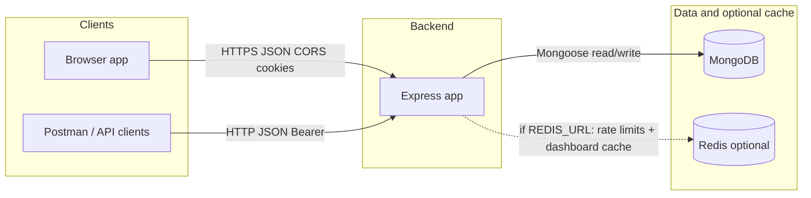
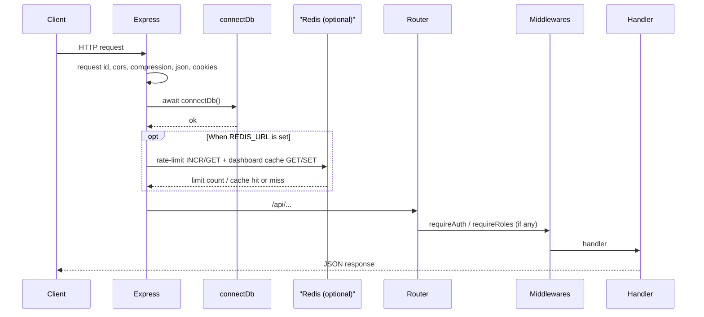
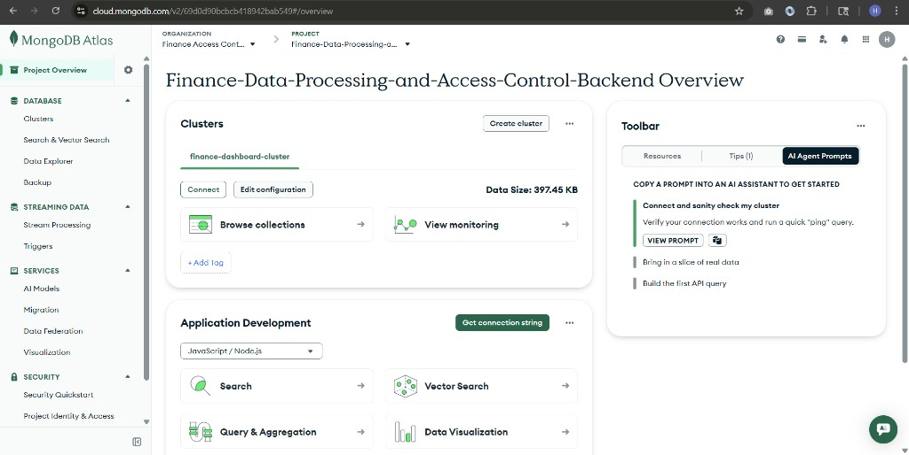
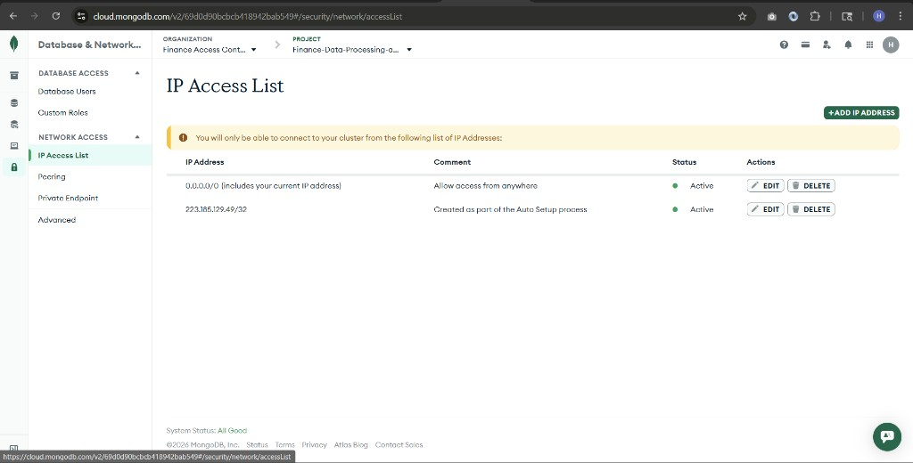
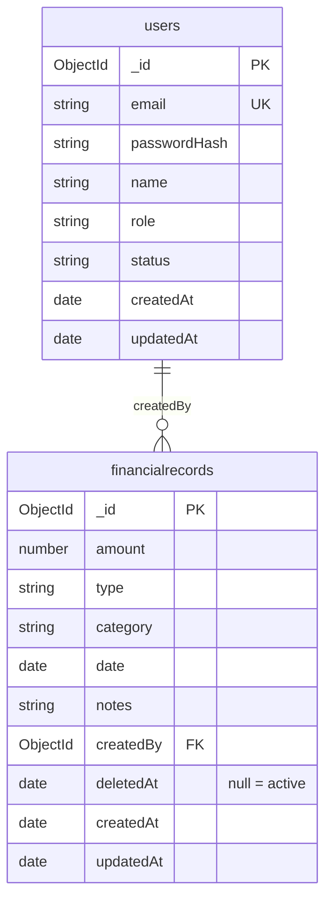
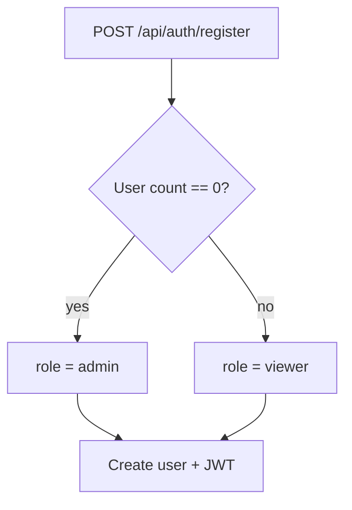

# Finance dashboard backend — system design

-HLD/LLD, workflows, requirements, and features for this repo. 
-Stack: Express + MongoDB; optional Redis (`REDIS_URL`) where **Non functional requirement point number 8** and also 4.1 / 5.2 say so.

See the [README](../README.md) for a short overview and [openapi.yaml](openapi.yaml) for route sketches.

---

## 1. Product features

| Area | Simple feature |
|---|---|
| Identity | Users can register, log in, and log out. Auth works with a JWT in an httpOnly cookie or a Bearer token. |
| Bootstrap | The first user who signs up becomes `admin`. Later public signups become `viewer`. Public users cannot choose their own role. |
| Users | Admins can view users with pagination, create users with a selected role, and update user role, status, or name. |
| Finance | The system manages income and expense records with amount, category, date, and notes. Listing supports filters and pagination. Access depends on role. |
| Dashboard | Users can view summary analytics such as totals, category breakdowns, recent activity, and monthly or weekly trends, with date filters. |
| Deployment | The app runs as a long-running Node service on Render. An optional `api/index.js` with `serverless-http` can support other hosts. |

---

## 2. Functional requirements

### 2.1 Authentication & sessions

- Users can register with email, password, and name; password must meet minimum length rules.
- Users can log in with email/password; server issues a JWT.
- Clients can send the JWT as an httpOnly cookie (`token`) or `Authorization: Bearer <jwt>`.
- Logout clears the auth cookie.
- Protected routes reject missing/invalid tokens and inactive accounts appropriately.

### 2.2 Authorization (RBAC)

- Roles: `viewer`, `analyst`, `admin` with documented permissions (see README).
- **Viewer:** access dashboard summary only; no finance list/write; no user management.
- **Analyst:** read finance records and dashboard; no writes to records or users.
- **Admin:** full finance CRUD and user management.

### 2.3 Users (admin)

- Admin can list users with pagination (`page`, `limit`, `total`).
- Admin can create users and set role explicitly.
- Admin can update user role, status, and name.

### 2.4 Finance records

- Admin can create/update/delete records with validated fields (type income/expense, positive amount, etc.).
- Analyst and admin can list and get-by-id with optional filters (type, category, date range) and pagination.

### 2.5 Dashboard

- Authenticated users (all roles) can fetch summary analytics with optional `dateFrom` / `dateTo` and `trend` (month/week).
---

## Non-functional requirements

### 1. Security
- Use bcrypt for password hashing.
- Use JWT (`HS256`) for authentication.
- Use httpOnly cookies in production.
- Require a strong `JWT_SECRET` in production.
- Enable `helmet` and `express-mongo-sanitize`.
- Return generic `500` error responses.

### 2. Admin bootstrap security
- Public signup must not assign admin freely.
- Only the first user may bootstrap as admin.
- After that, only admins can create users.

### 3. Data model
- Use a single shared dataset.
- Multi-tenant isolation is not supported.

### 4. Operations
- Provide a liveness health endpoint.
- Reuse MongoDB connection per process.
- Allow lazy connection on cold start.

### 5. Limits
- Cap JSON body size (for example, `1mb`).
- Enforce pagination upper bounds.
- Apply per-IP rate limiting on `/api`.
- Disable rate limiting in `NODE_ENV=test`.

### 6. Portability
- Support Node.js 18+.
- Run the same app locally and on Render or similar PaaS.
- Use environment-based configuration.

### 7. Scalability
- Keep the app stateless with HTTP + JWT.
- Make MongoDB pool size configurable.
- Enable response compression.
- Include `X-Request-Id` in responses.
- Expose:
  - `GET /api/health` for liveness
  - `GET /api/health/ready` for readiness
- On shutdown, close HTTP first, then Redis, then MongoDB.

### 8. Optional Redis
- If `REDIS_URL` is set:
  - use Redis for rate limiting
  - optionally cache `GET /api/dashboard/summary`
- Control cache TTL with `DASHBOARD_CACHE_TTL_SECONDS`
- Invalidate dashboard cache after create/update/soft-delete
- If Redis is not set:
  - keep rate limits in memory
  - run dashboard aggregation normally
- Redis is not required for tests or CI.
- Kafka/event streaming is out of scope.

---

## 4. High-level design (HLD)

### 4.1 Context



**Redis** is **optional** (see 8 in non functional requirement). If `REDIS_URL` is unset, the dashed link is unused: rate limits stay in-process and dashboard aggregations always hit MongoDB.

### 4.2 Logical architecture

- **API layer:** The system uses Express routes under `/api` for:
  - auth
  - users
  - finance
  - dashboard

- **Domain layer:** The main business areas are:
  - users
  - financial records  
  Role checks are applied before business logic runs.

- **Persistence layer:** Data is stored in MongoDB using Mongoose models.  
  Indexes are added on commonly used query fields.

- **Optional cache / coordination:** If `REDIS_URL` is configured:
  - Redis is used for shared rate-limit counters
  - Redis is also used for short-term dashboard summary caching
  - finance create/update actions refresh the cache generation

- **Cross-cutting concerns:** The system also includes:
  - CORS allowlist
  - JSON body parsing
  - cookie parsing
  - compression
  - request IDs
  - centralized error handling
  - database connection middleware
### 4.3 Deployment views

| Mode | Entry | Notes |
|------|--------|--------|
| **Node server** | `financedashboardbackend/src/server.js` | `connectDb` then `listen(PORT)`. |
| **Render (HTTPS)** | Same Node app on Render Web Service | Example production base URL: `https://finance-data-processing-and-access-jega.onrender.com` — see [README — Deploying](../README.md#deploying). |

Optional **serverless-style** entry: repo root `api/index.js` wraps the app with `serverless-http` (for hosts that expect a function handler); **Render** uses the Node server entry above.

---

## 5. Low-level design (LLD)

### 5.1 Module layout

```
financedashboardbackend/src/
├── app.js                 # Express app, middleware order, route mounting
├── server.js              # HTTP server + listen (non-serverless)
├── config/
│   ├── db.js              # Mongoose connect + pool options + disconnect
│   └── redisClient.js     # Optional ioredis singleton when REDIS_URL is set
├── models/
│   ├── user.js            # User schema, roles, bcrypt helpers, safe JSON
│   └── financialRecord.js # Record schema, indexes
├── routes/                # HTTP adapters only (validate input, call services, map responses)
│   ├── auth.js
│   ├── users.js
│   ├── finance.js
│   └── dashboard.js
├── services/              # Domain / use-cases (SOLID: SRP, routes depend on service API)
│   ├── httpResult.js      # ok/fail helpers + sendServiceResult
│   ├── auth.service.js
│   ├── user.service.js
│   ├── finance.service.js
│   ├── dashboard.service.js
│   └── dashboardCache.js  # Optional Redis cache keys + invalidation for dashboard summary
├── mappers/
│   └── financialRecord.mapper.js  # API DTO shape for records
├── middlewares/
│   ├── auth.js
│   ├── authorize.js
│   ├── rateLimit.js       # express-rate-limit; Redis store when REDIS_URL set
│   └── requestId.js       # X-Request-Id
└── utils/                 # validation, tokens, async handler
```

Routes stay thin; services own validation and DB work; routes → services → models.

### 5.2 Request pipeline (simplified)



If `REDIS_URL` is unset, the optional Redis step is skipped (in-memory limits, dashboard hits Mongo each time).

`GET /api/health` is registered **before** the global `connectDb` middleware in `app.js`, so liveness does not require MongoDB. **`GET /api/health/ready`** is mounted **after** `connectDb` and returns **503** if the driver is not connected—use for readiness/orchestrator probes. All other routes mounted after `connectDb` require a successful DB connection before route handlers run.

### 5.3 Database design

## Why MongoDB for this project

- MongoDB fits this project well because each finance record is a self-contained document with fields like:
  - `amount`
  - `type`
  - `category`
  - `date`
  - `notes`

- The dashboard needs totals, category breakdowns, and trend data.  
  MongoDB aggregation pipelines make this efficient in a single database round-trip.

- It is easy to evolve the schema as the project changes.  
  For example, adding a field like `deletedAt` for soft delete is simple.

- This project uses a **single-tenant** dataset, so advanced concerns like sharding and multi-region setup are out of scope.

## Connection

- The app uses a single MongoDB deployment.
- The database name comes from `MONGODB_URI`.  
  Example: if the URI path is `/finance_dashboard`, then the app uses the `finance_dashboard` database.

- The app accesses MongoDB through **Mongoose**.
- Mongoose models map application data to MongoDB collections.

## Connection pool settings

These environment variables control MongoDB connection behavior:

- `MONGODB_MAX_POOL_SIZE`  
  Default: `10`  
  Controls the maximum number of connections.

- `MONGODB_MIN_POOL_SIZE`  
  Default: `0`  
  Controls the minimum number of connections kept open.

- `MONGODB_SERVER_SELECTION_TIMEOUT_MS`  
  Default: `10000`  
  Controls how long the app waits when selecting a MongoDB server.

## Optional Redis

- Redis is used only if `REDIS_URL` is set.
- When enabled, the app uses one shared **ioredis** client for:
  - rate-limit storage
  - dashboard summary cache keys

- Cache keys use the `financedash:*` pattern.

- Redis is **optional**.  
  The app still works correctly without it.

**MongoDB Atlas on AWS (console)**

The database is hosted on **MongoDB Atlas**; the cluster runs on **AWS**. Below: project overview (`finance-dashboard-cluster`) and **Network Access** (IP allow list). The same figures appear under [README — Database (modeling)](../README.md#database-modeling).





**MongoDB Compass (example)**

Data exploration against the same Atlas cluster (not a local `mongod`). PNGs live under `docs/images/` — also in the [README](../README.md#database-modeling).


**Collections (Mongoose defaults)**

| Mongoose model | Collection name (typical) | Purpose |
|----------------|---------------------------|---------|
| `User` | `users` | Accounts, roles, credentials. |
| `FinancialRecord` | `financialrecords` | Income/expense rows; `createdBy` links to users. |

**Relationship**

- One **User** may have many **FinancialRecord** documents via **`createdBy`** → `User._id` (ObjectId ref `User`).  
- No embedded subdocuments; shared pool of records for the app (no per-tenant split).

**Referential integrity**

- MongoDB does not enforce foreign keys. New records set **`createdBy`** from the authenticated user id (JWT `sub`), not from arbitrary client input, so references stay consistent with active accounts.



**`users` — fields & constraints**

| Field | Type | Notes |
|-------|------|--------|
| `_id` | ObjectId | Primary key. |
| `email` | String | Required, **unique** index; Mongoose `lowercase: true` + `trim` on write. |
| `passwordHash` | String | Required; bcrypt; not selected by default in queries. |
| `name` | String | Optional display name; default `""`. |
| `role` | String | Enum: `viewer`, `analyst`, `admin`; default `viewer`. |
| `status` | String | Enum: `active`, `inactive`; default `active`. |
| `createdAt` / `updatedAt` | Date | From `{ timestamps: true }`. |

**`financialrecords` — fields & constraints**

| Field | Type | Notes |
|-------|------|--------|
| `_id` | ObjectId | Primary key. |
| `amount` | Number | Required, **≥ 0**. |
| `type` | String | Enum: `income`, `expense`. |
| `category` | String | Required; trimmed. |
| `date` | Date | Required; business date of the record. |
| `notes` | String | Optional; default `""`. |
| `createdBy` | ObjectId | Required; ref **User**. |
| `deletedAt` | Date | Default `null`; set when the record is **soft-deleted** (omit from API lists and aggregates). |
| `createdAt` / `updatedAt` | Date | From `{ timestamps: true }`. |

**Indexes declared in code** (`financialRecord.js`)

| Index | Rationale | Typical query |
|-------|-----------|----------------|
| `{ deletedAt: 1 }` | Almost every read scopes to **active** rows. | `find({ deletedAt: null, … })` |
| `{ date: -1 }` | List and recent-activity paths sort by **business date** descending. | `find(…).sort({ date: -1 })` |
| `{ category: 1 }` | Exact category filter (case-insensitive regex in app). | `find({ category: … })` |
| `{ type: 1 }` | Filter **income** vs **expense**. | `find({ type: … })` |
| `{ createdBy: 1 }` | Optional “by author” or cleanup if users are removed later. | `find({ createdBy: … })` |
| `{ deletedAt: 1, date: -1 }` | **Compound:** active rows in a date window, sorted by date (list + dashboard `$match` + sort). | Active-only lists and time-range dashboards |
| `{ deletedAt: 1, type: 1, date: -1 }` | **Compound:** active rows filtered by **type** and sorted by date (common list query). | `find({ deletedAt: null, type: … }).sort({ date: -1 })` |

MongoDB can use the compound index when the query filters on `deletedAt` and sorts or ranges on `date`. Single-field indexes remain useful when only one predicate is selective.

**Other indexes**

- **`users.email`:** uniqueness enforced via schema `unique: true` (MongoDB unique index).
- **`users.createdAt` (descending):** admin user list sorted by registration time (`User.find({}).sort({ createdAt: -1 })`).

**Consistency rules (enforced in schema + app)**

| Rule | Where |
|------|--------|
| Unique login identity | `users.email` unique index + lowercase trim on write. |
| No negative amounts | `amount` `min: 0` on `FinancialRecord`. |
| Closed enums | `role`, `status`, `type` via Mongoose `enum`. |
| Soft delete visibility | All list/get/update/dashboard paths add **`deletedAt: null`** (or equivalent) so deleted docs disappear from API semantics. |
| `createdBy` validity | Not a DB foreign key; set from authenticated user id on create, not raw client input. |

**Schema changes and existing documents**

- Adding **`deletedAt`** did not require backfilling: queries use **`{ deletedAt: null }`**, which in MongoDB matches documents where the field is **missing** or explicitly **`null`**, so older rows without the field still behave as active.  
- New optional fields should follow the same pattern (default `null` / sensible default) to avoid one-off migrations for small deployments.

**Not modeled in DB**

- JWT sessions are stateless (no `sessions` collection).  
- Finance records use **soft delete**: `deletedAt` is set on delete; list/get/update/dashboard ignore deleted rows (`deletedAt: null` only).  
- User deletion (if introduced) would not cascade; existing `financialrecords` could retain orphan `createdBy` values unless handled in application logic.

### 5.4 Auth token

- JWT payload uses `sub` = user id; expiry from `JWT_EXPIRES_IN` (default 7d).  
- Cookie: `httpOnly`, `secure` when `NODE_ENV=production`, `sameSite` strict in prod.

### 5.5 Key API surface (prefix `/api`)

| Prefix | Responsibility |
|--------|----------------|
| `/auth` | Register, login, logout, `me` |
| `/users` | Admin user management |
| `/finance/records` | Record CRUD + list |
| `/dashboard` | Summary aggregates |

---

## 6. Workflows

### 6.1 First-time bootstrap (empty `users`)



### 6.2 Admin creates user with role (e.g. analyst/admin)

1. Admin logs in → receives JWT (cookie or Bearer).  
2. `POST /api/users` with `email`, `password`, `name`, `role`.  
3. Server validates role and creates user.

### 6.3 Analyst reads finance list

1. User logs in (analyst or admin).  
2. `GET /api/finance/records?...` — `requireAuth` + `requireRoles(analyst, admin)`.

### 6.4 Admin writes finance record

1. Admin logs in.  
2. `POST /api/finance/records` with body fields — `requireRoles(admin)`.

### 6.5 Dashboard summary (any authenticated role)

1. User logs in (viewer/analyst/admin).  
2. `GET /api/dashboard/summary?dateFrom&dateTo&trend` — aggregation pipeline on `FinancialRecord` (see `dashboard.service.js`).  
3. If **`REDIS_URL`** is set, the handler may return a **cached JSON payload** from Redis (`dashboardCache.js`, TTL **`DASHBOARD_CACHE_TTL_SECONDS`**); any finance record **create / update / soft-delete** bumps a generation counter so cached rows are not reused after data changes. If Redis is not configured, every request runs the aggregation.

---

## 7. Error & status conventions (behavioral)

- **400:** Validation failures (often `details` array).  
- **401:** Missing/invalid token, or user id in token not found.  
- **403:** Wrong role or inactive account.  
- **404:** Resource id not found (user/record).  
- **409:** Duplicate email on register/create user.  
- **500:** Unexpected server errors; JWT misconfiguration returns 500 where applicable.

---

## 8. Out of scope / assumptions (design boundaries)

- No OAuth/Social login.  
- No per-tenant / org isolation.  
- No email verification or password reset flows in API.  
- Category filter semantics are exact match (case-insensitive), not full-text search.

---

