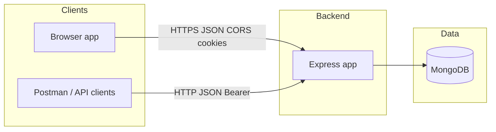
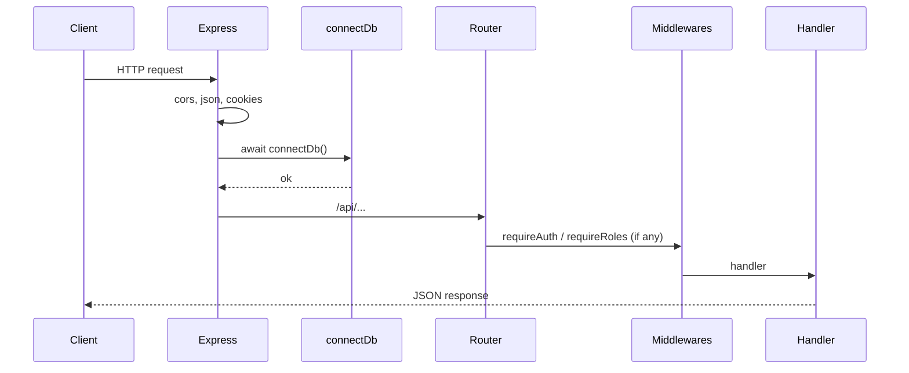
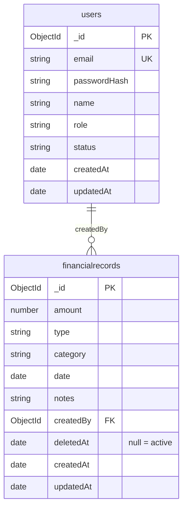
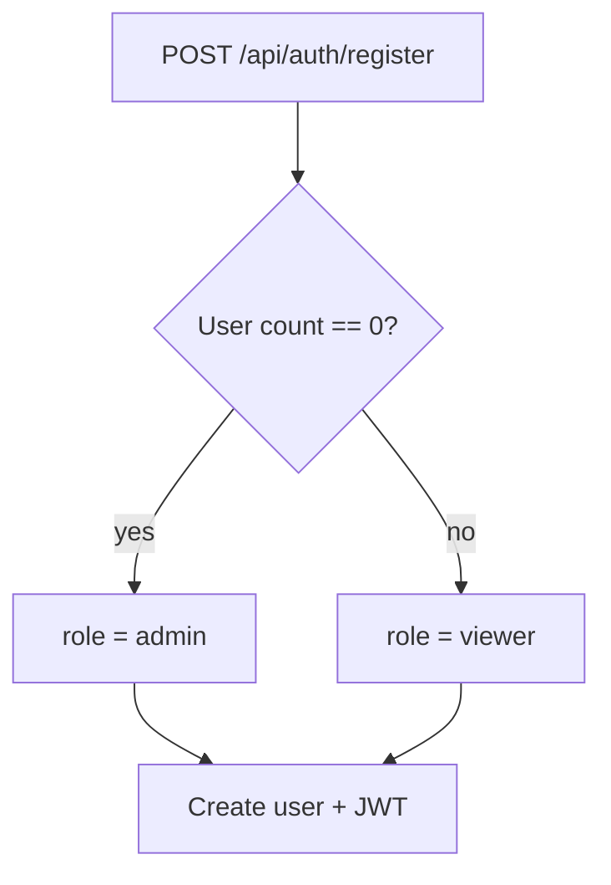

# Finance dashboard backend — system design

This document summarizes **high-level design (HLD)**, **low-level design (LLD)**, **workflows**, **requirements**, and **features** for this repository. It reflects the current Express + MongoDB implementation.

The [README](../README.md) has a short request-flow overview, RBAC table, and HTTP status list. [openapi.yaml](openapi.yaml) lists example paths.

---

## 1. Product features (what the system does)

| Area | Feature |
|------|---------|
| **Identity** | Register, login, logout; JWT in httpOnly cookie or `Authorization: Bearer`. |
| **Bootstrap** | First registered user in the database becomes **admin**; later self-registrations are **viewer** (role is not chosen on public register). |
| **Users** | Admins list users (paginated), create users with a chosen role, update role/status/name. |
| **Finance** | Financial records (income/expense) with amount, category, date, notes; list with filters and pagination; CRUD restricted by role. |
| **Dashboard** | Aggregated summary: totals, by category, recent activity, monthly or weekly trends; date-range filters. |
| **Deployment** | Long-running Node server (e.g. Render) **or** Vercel serverless via `api/index.js` + `serverless-http`. |

---

## 2. Functional requirements

### 2.1 Authentication & sessions

- **FR-A1:** Users can register with email, password, and name; password must meet minimum length rules.
- **FR-A2:** Users can log in with email/password; server issues a JWT.
- **FR-A3:** Clients can send the JWT as an httpOnly cookie (`token`) or `Authorization: Bearer <jwt>`.
- **FR-A4:** Logout clears the auth cookie.
- **FR-A5:** Protected routes reject missing/invalid tokens and inactive accounts appropriately.

### 2.2 Authorization (RBAC)

- **FR-Z1:** Roles: `viewer`, `analyst`, `admin` with documented permissions (see README).
- **FR-Z2:** **Viewer:** access dashboard summary only; no finance list/write; no user management.
- **FR-Z3:** **Analyst:** read finance records + dashboard; no writes to records or users.
- **FR-Z4:** **Admin:** full finance CRUD + user management.

### 2.3 Users (admin)

- **FR-U1:** Admin can list users with pagination (`page`, `limit`, `total`).
- **FR-U2:** Admin can create users and set **role** explicitly.
- **FR-U3:** Admin can update user role, status, name.

### 2.4 Finance records

- **FR-F1:** Admin can create/update/delete records with validated fields (type income/expense, positive amount, etc.).
- **FR-F2:** Analyst and admin can list and get-by-id with optional filters (type, category, date range) and pagination.

### 2.5 Dashboard

- **FR-D1:** Authenticated users (all roles) can fetch summary analytics with optional `dateFrom`/`dateTo` and `trend` (month/week).

---

## 3. Non-functional requirements

| ID | Category | Requirement |
|----|----------|-------------|
| **NFR-1** | Security | Passwords stored as bcrypt hashes; JWT signed with server secret; httpOnly cookies in production. |
| **NFR-2** | Security | Public registration cannot assign arbitrary admin (first-user bootstrap + admin-only user API). |
| **NFR-3** | Data | Single shared dataset (no multi-tenant isolation in schema). |
| **NFR-4** | Ops | Health endpoint for liveness; MongoDB connection reused per process / lazy on serverless. |
| **NFR-5** | Limits | JSON body size capped (e.g. 1mb); pagination upper bounds on list endpoints; per-IP rate limits on `/api` (auth vs general), disabled in `NODE_ENV=test`. |
| **NFR-6** | Portability | Node 18+; same app runs locally, on PaaS, or Vercel functions with env-based config. |

---

## 4. High-level design (HLD)

### 4.1 Context



### 4.2 Logical architecture

- **API layer:** Express routers under `/api` (auth, users, finance, dashboard).
- **Domain:** Users and financial records; role checks before business logic.
- **Persistence:** Mongoose models + MongoDB (indexes on common query fields).
- **Cross-cutting:** CORS allowlist, JSON parsing, cookie parsing, centralized error handling, DB connection middleware.

### 4.3 Deployment views

| Mode | Entry | Notes |
|------|--------|--------|
| **Node server** | `financedashboardbackend/src/server.js` | `connectDb` then `listen(PORT)`. |
| **Vercel** | `api/index.js` → `serverless-http(app)` | Root `vercel.json` rewrites to `/api/index`; workspace install bundles backend. |

---

## 5. Low-level design (LLD)

### 5.1 Module layout

```
financedashboardbackend/src/
├── app.js                 # Express app, middleware order, route mounting
├── server.js              # HTTP server + listen (non-serverless)
├── config/db.js           # Mongoose connect + connection reuse
├── models/
│   ├── user.js            # User schema, roles, bcrypt helpers, safe JSON
│   └── financialRecord.js # Record schema, indexes
├── routes/                # HTTP adapters only (validate input, call services, map responses)
│   ├── auth.js
│   ├── users.js
│   ├── finance.js
│   └── dashboard.js
├── services/              # Domain / use-cases (SOLID: SRP, routes depend on service API)
│   ├── httpResult.js      # ok/fail helpers + sendServiceResult
│   ├── auth.service.js
│   ├── user.service.js
│   ├── finance.service.js
│   └── dashboard.service.js
├── mappers/
│   └── financialRecord.mapper.js  # API DTO shape for records
├── middlewares/
│   ├── auth.js
│   └── authorize.js
└── utils/                 # validation, tokens, async handler
```

**SOLID mapping (pragmatic):** Services own business rules and persistence orchestration; routes stay thin (HTTP + validation). Open/closed: new behaviors can add new service functions with minimal route changes. Dependency direction: routes → services → models (finance/dashboard routes no longer embed query/aggregation logic).

### 5.2 Request pipeline (simplified)



Note: `GET /api/health` is registered **before** the global `connectDb` middleware in `app.js`, so health does not require MongoDB. All routes mounted **after** that middleware require a successful DB connection before route handlers run.

### 5.3 Database design

**Why MongoDB for this project**

- **Document model** fits finance rows as self-contained documents (amount, type, category, date, notes) without rigid joins for every read.  
- **Aggregation pipeline** matches how the dashboard computes totals, category breakdowns, and trends in one round-trip to the database.  
- **Iteration cost** is low when fields evolve (e.g. adding `deletedAt` for soft delete) compared to relational migrations for a small codebase.  
- Scope is a **single-tenant** dataset (see NFR-3); sharding and multi-region are out of scope here.

**Connection**

- Single MongoDB deployment; database name comes from **`MONGODB_URI`** (e.g. path `/finance_dashboard` in the URI picks that database).
- Access via **Mongoose**; models map to collections as below.

**Collections (Mongoose defaults)**

| Mongoose model | Collection name (typical) | Purpose |
|----------------|---------------------------|---------|
| `User` | `users` | Accounts, roles, credentials. |
| `FinancialRecord` | `financialrecords` | Income/expense rows; `createdBy` links to users. |

**Relationship**

- One **User** may have many **FinancialRecord** documents via **`createdBy`** → `User._id` (ObjectId ref `User`).  
- No embedded subdocuments; shared pool of records for the app (no per-tenant split).

**Referential integrity**

- MongoDB does not enforce foreign keys. New records set **`createdBy`** from the authenticated user id (JWT `sub`), not from arbitrary client input, so references stay consistent with active accounts.



**`users` — fields & constraints**

| Field | Type | Notes |
|-------|------|--------|
| `_id` | ObjectId | Primary key. |
| `email` | String | Required, **unique** index; Mongoose `lowercase: true` + `trim` on write. |
| `passwordHash` | String | Required; bcrypt; not selected by default in queries. |
| `name` | String | Optional display name; default `""`. |
| `role` | String | Enum: `viewer`, `analyst`, `admin`; default `viewer`. |
| `status` | String | Enum: `active`, `inactive`; default `active`. |
| `createdAt` / `updatedAt` | Date | From `{ timestamps: true }`. |

**`financialrecords` — fields & constraints**

| Field | Type | Notes |
|-------|------|--------|
| `_id` | ObjectId | Primary key. |
| `amount` | Number | Required, **≥ 0**. |
| `type` | String | Enum: `income`, `expense`. |
| `category` | String | Required; trimmed. |
| `date` | Date | Required; business date of the record. |
| `notes` | String | Optional; default `""`. |
| `createdBy` | ObjectId | Required; ref **User**. |
| `deletedAt` | Date | Default `null`; set when the record is **soft-deleted** (omit from API lists and aggregates). |
| `createdAt` / `updatedAt` | Date | From `{ timestamps: true }`. |

**Indexes declared in code** (`financialRecord.js`)

| Index | Rationale | Typical query |
|-------|-----------|----------------|
| `{ deletedAt: 1 }` | Almost every read scopes to **active** rows. | `find({ deletedAt: null, … })` |
| `{ date: -1 }` | List and recent-activity paths sort by **business date** descending. | `find(…).sort({ date: -1 })` |
| `{ category: 1 }` | Exact category filter (case-insensitive regex in app). | `find({ category: … })` |
| `{ type: 1 }` | Filter **income** vs **expense**. | `find({ type: … })` |
| `{ createdBy: 1 }` | Optional “by author” or cleanup if users are removed later. | `find({ createdBy: … })` |
| `{ deletedAt: 1, date: -1 }` | **Compound:** active rows in a date window, sorted by date (list + dashboard `$match` + sort). | Active-only lists and time-range dashboards |

MongoDB can use the compound index when the query filters on `deletedAt` and sorts or ranges on `date`. Single-field indexes remain useful when only one predicate is selective.

**Other indexes**

- **`users.email`:** uniqueness enforced via schema `unique: true` (MongoDB unique index).

**Consistency rules (enforced in schema + app)**

| Rule | Where |
|------|--------|
| Unique login identity | `users.email` unique index + lowercase trim on write. |
| No negative amounts | `amount` `min: 0` on `FinancialRecord`. |
| Closed enums | `role`, `status`, `type` via Mongoose `enum`. |
| Soft delete visibility | All list/get/update/dashboard paths add **`deletedAt: null`** (or equivalent) so deleted docs disappear from API semantics. |
| `createdBy` validity | Not a DB foreign key; set from authenticated user id on create, not raw client input. |

**Schema changes and existing documents**

- Adding **`deletedAt`** did not require backfilling: queries use **`{ deletedAt: null }`**, which in MongoDB matches documents where the field is **missing** or explicitly **`null`**, so older rows without the field still behave as active.  
- New optional fields should follow the same pattern (default `null` / sensible default) to avoid one-off migrations for small deployments.

**Not modeled in DB**

- JWT sessions are stateless (no `sessions` collection).  
- Finance records use **soft delete**: `deletedAt` is set on delete; list/get/update/dashboard ignore deleted rows (`deletedAt: null` only).  
- User deletion (if introduced) would not cascade; existing `financialrecords` could retain orphan `createdBy` values unless handled in application logic.

### 5.4 Auth token

- JWT payload uses `sub` = user id; expiry from `JWT_EXPIRES_IN` (default 7d).  
- Cookie: `httpOnly`, `secure` when `NODE_ENV=production`, `sameSite` strict in prod.

### 5.5 Key API surface (prefix `/api`)

| Prefix | Responsibility |
|--------|----------------|
| `/auth` | Register, login, logout, `me` |
| `/users` | Admin user management |
| `/finance/records` | Record CRUD + list |
| `/dashboard` | Summary aggregates |

---

## 6. Workflows

### 6.1 First-time bootstrap (empty `users`)



### 6.2 Admin creates user with role (e.g. analyst/admin)

1. Admin logs in → receives JWT (cookie or Bearer).  
2. `POST /api/users` with `email`, `password`, `name`, `role`.  
3. Server validates role and creates user.

### 6.3 Analyst reads finance list

1. User logs in (analyst or admin).  
2. `GET /api/finance/records?...` — `requireAuth` + `requireRoles(analyst, admin)`.

### 6.4 Admin writes finance record

1. Admin logs in.  
2. `POST /api/finance/records` with body fields — `requireRoles(admin)`.

### 6.5 Dashboard summary (any authenticated role)

1. User logs in (viewer/analyst/admin).  
2. `GET /api/dashboard/summary?dateFrom&dateTo&trend` — aggregation pipeline on `FinancialRecord`.

---

## 7. Error & status conventions (behavioral)

- **400:** Validation failures (often `details` array).  
- **401:** Missing/invalid token, or user id in token not found.  
- **403:** Wrong role or inactive account.  
- **404:** Resource id not found (user/record).  
- **409:** Duplicate email on register/create user.  
- **500:** Unexpected server errors; JWT misconfiguration returns 500 where applicable.

---

## 8. Out of scope / assumptions (design boundaries)

- No OAuth/Social login.  
- No per-tenant / org isolation.  
- No email verification or password reset flows in API.  
- Category filter semantics are exact match (case-insensitive), not full-text search.

---

## 9. Document maintenance

Update this file when you add routes, change RBAC, or alter deployment (e.g. new entrypoint or queue). The **README** remains the place for runbooks and env vars for operators.
