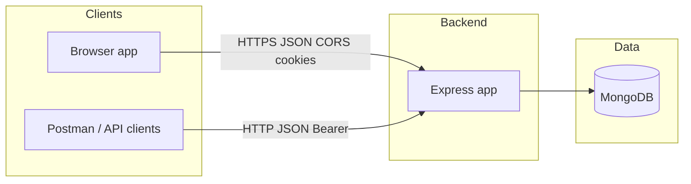
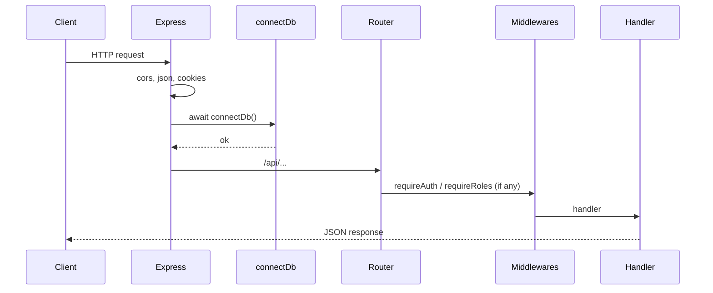
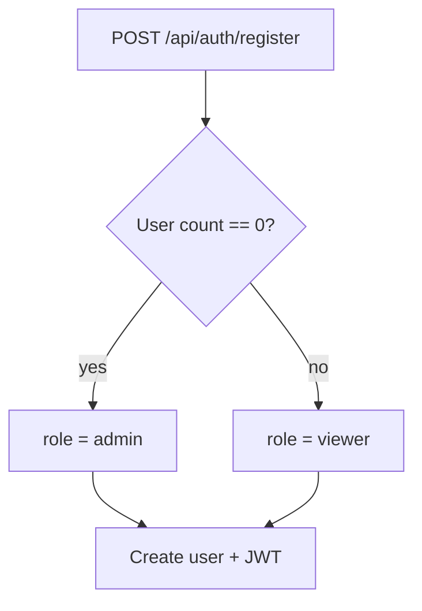

# Finance dashboard backend — system design

This document summarizes **high-level design (HLD)**, **low-level design (LLD)**, **workflows**, **requirements**, and **features** for this repository. It reflects the current Express + MongoDB implementation.

---

## 1. Product features (what the system does)

| Area | Feature |
|------|---------|
| **Identity** | Register, login, logout; JWT in httpOnly cookie or `Authorization: Bearer`. |
| **Bootstrap** | First registered user in the database becomes **admin**; later self-registrations are **viewer** (role is not chosen on public register). |
| **Users** | Admins list users (paginated), create users with a chosen role, update role/status/name. |
| **Finance** | Financial records (income/expense) with amount, category, date, notes; list with filters and pagination; CRUD restricted by role. |
| **Dashboard** | Aggregated summary: totals, by category, recent activity, monthly or weekly trends; date-range filters. |
| **Deployment** | Long-running Node server (e.g. Render) **or** Vercel serverless via `api/index.js` + `serverless-http`. |

---

## 2. Functional requirements

### 2.1 Authentication & sessions

- **FR-A1:** Users can register with email, password, and name; password must meet minimum length rules.
- **FR-A2:** Users can log in with email/password; server issues a JWT.
- **FR-A3:** Clients can send the JWT as an httpOnly cookie (`token`) or `Authorization: Bearer <jwt>`.
- **FR-A4:** Logout clears the auth cookie.
- **FR-A5:** Protected routes reject missing/invalid tokens and inactive accounts appropriately.

### 2.2 Authorization (RBAC)

- **FR-Z1:** Roles: `viewer`, `analyst`, `admin` with documented permissions (see README).
- **FR-Z2:** **Viewer:** access dashboard summary only; no finance list/write; no user management.
- **FR-Z3:** **Analyst:** read finance records + dashboard; no writes to records or users.
- **FR-Z4:** **Admin:** full finance CRUD + user management.

### 2.3 Users (admin)

- **FR-U1:** Admin can list users with pagination (`page`, `limit`, `total`).
- **FR-U2:** Admin can create users and set **role** explicitly.
- **FR-U3:** Admin can update user role, status, name.

### 2.4 Finance records

- **FR-F1:** Admin can create/update/delete records with validated fields (type income/expense, positive amount, etc.).
- **FR-F2:** Analyst and admin can list and get-by-id with optional filters (type, category, date range) and pagination.

### 2.5 Dashboard

- **FR-D1:** Authenticated users (all roles) can fetch summary analytics with optional `dateFrom`/`dateTo` and `trend` (month/week).

---

## 3. Non-functional requirements

| ID | Category | Requirement |
|----|----------|-------------|
| **NFR-1** | Security | Passwords stored as bcrypt hashes; JWT signed with server secret; httpOnly cookies in production. |
| **NFR-2** | Security | Public registration cannot assign arbitrary admin (first-user bootstrap + admin-only user API). |
| **NFR-3** | Data | Single shared dataset (no multi-tenant isolation in schema). |
| **NFR-4** | Ops | Health endpoint for liveness; MongoDB connection reused per process / lazy on serverless. |
| **NFR-5** | Limits | JSON body size capped (e.g. 1mb); pagination upper bounds on list endpoints. |
| **NFR-6** | Portability | Node 18+; same app runs locally, on PaaS, or Vercel functions with env-based config. |

---

## 4. High-level design (HLD)

### 4.1 Context



### 4.2 Logical architecture

- **API layer:** Express routers under `/api` (auth, users, finance, dashboard).
- **Domain:** Users and financial records; role checks before business logic.
- **Persistence:** Mongoose models + MongoDB (indexes on common query fields).
- **Cross-cutting:** CORS allowlist, JSON parsing, cookie parsing, centralized error handling, DB connection middleware.

### 4.3 Deployment views

| Mode | Entry | Notes |
|------|--------|--------|
| **Node server** | `financedashboardbackend/src/server.js` | `connectDb` then `listen(PORT)`. |
| **Vercel** | `api/index.js` → `serverless-http(app)` | Root `vercel.json` rewrites to `/api/index`; workspace install bundles backend. |

---

## 5. Low-level design (LLD)

### 5.1 Module layout

```
financedashboardbackend/src/
├── app.js                 # Express app, middleware order, route mounting
├── server.js              # HTTP server + listen (non-serverless)
├── config/db.js           # Mongoose connect + connection reuse
├── models/
│   ├── user.js            # User schema, roles, bcrypt helpers, safe JSON
│   └── financialRecord.js # Record schema, indexes
├── routes/                # HTTP adapters only (validate input, call services, map responses)
│   ├── auth.js
│   ├── users.js
│   ├── finance.js
│   └── dashboard.js
├── services/              # Domain / use-cases (SOLID: SRP, routes depend on service API)
│   ├── httpResult.js      # ok/fail helpers + sendServiceResult
│   ├── auth.service.js
│   ├── user.service.js
│   ├── finance.service.js
│   └── dashboard.service.js
├── mappers/
│   └── financialRecord.mapper.js  # API DTO shape for records
├── middlewares/
│   ├── auth.js
│   └── authorize.js
└── utils/                 # validation, tokens, async handler
```

**SOLID mapping (pragmatic):** Services own business rules and persistence orchestration; routes stay thin (HTTP + validation). Open/closed: new behaviors can add new service functions with minimal route changes. Dependency direction: routes → services → models (finance/dashboard routes no longer embed query/aggregation logic).

### 5.2 Request pipeline (simplified)



Note: `GET /api/health` is registered **before** the global `connectDb` middleware in `app.js`, so health does not require MongoDB. All routes mounted **after** that middleware require a successful DB connection before route handlers run.

### 5.3 Data model (conceptual)

**User**

- `email` (unique), `passwordHash`, `name`, `role` (enum), `status` (active/inactive), timestamps.

**FinancialRecord**

- `amount`, `type` (income/expense), `category`, `date`, `notes`, `createdBy` → User ref, timestamps.  
- Indexes: `date`, `category`, `type`, `createdBy` (as implemented).

### 5.4 Auth token

- JWT payload uses `sub` = user id; expiry from `JWT_EXPIRES_IN` (default 7d).  
- Cookie: `httpOnly`, `secure` when `NODE_ENV=production`, `sameSite` strict in prod.

### 5.5 Key API surface (prefix `/api`)

| Prefix | Responsibility |
|--------|----------------|
| `/auth` | Register, login, logout, `me` |
| `/users` | Admin user management |
| `/finance/records` | Record CRUD + list |
| `/dashboard` | Summary aggregates |

---

## 6. Workflows

### 6.1 First-time bootstrap (empty `users`)



### 6.2 Admin creates user with role (e.g. analyst/admin)

1. Admin logs in → receives JWT (cookie or Bearer).  
2. `POST /api/users` with `email`, `password`, `name`, `role`.  
3. Server validates role and creates user.

### 6.3 Analyst reads finance list

1. User logs in (analyst or admin).  
2. `GET /api/finance/records?...` — `requireAuth` + `requireRoles(analyst, admin)`.

### 6.4 Admin writes finance record

1. Admin logs in.  
2. `POST /api/finance/records` with body fields — `requireRoles(admin)`.

### 6.5 Dashboard summary (any authenticated role)

1. User logs in (viewer/analyst/admin).  
2. `GET /api/dashboard/summary?dateFrom&dateTo&trend` — aggregation pipeline on `FinancialRecord`.

---

## 7. Error & status conventions (behavioral)

- **400:** Validation failures (often `details` array).  
- **401:** Missing/invalid token, or user id in token not found.  
- **403:** Wrong role or inactive account.  
- **404:** Resource id not found (user/record).  
- **409:** Duplicate email on register/create user.  
- **500:** Unexpected server errors; JWT misconfiguration returns 500 where applicable.

---

## 8. Out of scope / assumptions (design boundaries)

- No OAuth/Social login.  
- No per-tenant / org isolation.  
- No email verification or password reset flows in API.  
- Category filter semantics are exact match (case-insensitive), not full-text search.

---

## 9. Document maintenance

Update this file when you add routes, change RBAC, or alter deployment (e.g. new entrypoint or queue). The **README** remains the place for runbooks and env vars for operators.
